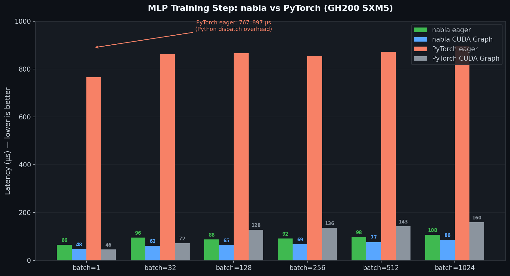

<p align="center">
  
</p>

<p align="center">
  <a href="https://github.com/fumishiki/nabla/actions/workflows/ci.yml"></a>
  <a href="https://crates.io/crates/nabla"></a>
  <a href="https://docs.rs/nabla"></a>
  <a href="https://github.com/fumishiki/nabla"></a>
  <a href="https://github.com/fumishiki/nabla/stargazers"></a>
  <a href="https://github.com/fumishiki/nabla/commits"></a>
  <a href="LICENSE"></a>
  <a href="https://www.rust-lang.org"></a>
  
  
  
</p>

# ∇ nabla

nabla is a Rust library that provides two things:
- **GPU-accelerated tensor math** — the operations you know from NumPy/PyTorch, running natively on NVIDIA, AMD, or Vulkan/Metal GPUs
- **A complete ML training stack** — model building, autodiff, optimizers, and model export, all in pure Rust with no C++ required

If you know PyTorch, nabla will feel immediately familiar. The difference: you get Rust's safety guarantees, no garbage collector, and in many cases faster GPU execution than PyTorch.

| Package | What it does |
|---|---|
| [**`nabla-core`**](docs-en/spec.md) | The tensor engine. 190+ operations — slicing, broadcasting, linear algebra, convolutions — on CPU, NVIDIA, AMD, or Vulkan/Metal GPU. |
| [**`nabla-macros`**](docs-en/notation.md) | Write math as code. `einsum!`, `fuse!`, `sym!`, `math!` macros. |
| [**`nabla-ml`**](docs-en/notation.md) | Automatic gradients, 45+ linear algebra routines, symbolic math, and ODE solvers. |
| [**`nabla-train`**](docs-en/quick_start.md) | Optimizers, LR schedules, data loading, checkpointing, quantization, and ONNX export. |
| [**`nabla-interface`**](docs-en/quick_start.md) | Export to GGUF and run locally with llama.cpp, Ollama, or LM Studio — including GPU offload on Apple Silicon. |
| [**`nabla-cli`**](docs-en/spec.md) | A standalone binary providing hardware diagnostics, benchmarking, model export, and inference. |

<!-- toc -->

- [Performance](#performance)
- [Tensor Library](#tensor-library)
- [Automatic Differentiation](#automatic-differentiation)
- [Training Stack](#training-stack)
- [Model Inference](#model-inference)
- [Symbolic Math & ODE Solvers](#symbolic-math--ode-solvers)
- [Macro DSL](#macro-dsl)
- [No Silent Errors](#no-silent-errors)
- [CLI Tool](#cli-tool)
- [Installation](#installation)
- [Getting Started](#getting-started)
- [Contributing](#contributing)
- [License](#license)

<!-- tocstop -->

---

## Performance



**Benchmark on GH200 480GB (CUDA 12.8, PyTorch 2.7.0)**

Full training step (forward + backward + optimizer):

| Batch size | nabla eager | nabla CUDA Graph | PyTorch eager | PyTorch compile | PyTorch CUDA Graph | nabla eager speedup |
|---:|---:|---:|---:|---:|---:|---:|
| 1 | 66 µs | **48 µs** | 767 µs | 562 µs | 46 µs | **11.6×** |
| 32 | 96 µs | **62 µs** | 863 µs | 578 µs | 72 µs | **9.0×** |
| 128 | 88 µs | **65 µs** | 867 µs | 585 µs | 128 µs | **9.9×** |
| 256 | 92 µs | **69 µs** | 855 µs | 586 µs | 136 µs | **9.3×** |
| 512 | 98 µs | **77 µs** | 872 µs | 585 µs | 143 µs | **8.9×** |
| 1024 | 108 µs | **86 µs** | 897 µs | 591 µs | 160 µs | **8.3×** |

> Model: MLP 784→256→128→10, MSE sum loss, SGD.
> PyTorch 2.10.0+cu128 / triton 3.6.0. Scripts: [`benchmarks/bench_pytorch.py`](benchmarks/bench_pytorch.py) vs [`benchmarks/src/profile_train_graph.rs`](benchmarks/src/profile_train_graph.rs).
> Raw data: [`assets/benchmark_mlp.csv`](assets/benchmark_mlp.csv)

nabla eager is **8.3–11.6× faster** than PyTorch eager, and **5.4–6.8× faster** than `torch.compile`. nabla CUDA Graph beats PyTorch CUDA Graph by **1.5–2.0×** at batch≥32.

**Why nabla is faster:**

- **No interpreter overhead.** Every PyTorch kernel launch travels through the Python interpreter, ATen dispatch, and the GIL — roughly 7 µs of CPU overhead per op. Rust calls the CUDA runtime in a single function call.
- **Kernel fusion via `fuse!`.** `a.sin().powf(2.0)` in PyTorch launches two kernels with an intermediate buffer. `fuse!` JIT-compiles a single kernel at compile time — no round-trip to GPU memory.
- **CUDA Graph replay.** A training loop runs the same kernel sequence every iteration. nabla records it once and replays the recording — ~1 µs total scheduling cost instead of hundreds of µs.
- **Fused loss and optimizer kernels.** `k_mse_sum_fwd` folds `sub → square → sum` into one kernel. `k_multi_axpy3` updates all parameters in a single vectorized pass.
- **No CPU fallback.** In nabla, every op either has a GPU implementation or the code does not compile. No silent "oops, that ran on CPU" round-trips.

Reproduce locally: `cd benchmarks && bash run.sh`

---

## Tensor Library

nabla provides tensors that run on CPU or GPU with no code changes — the backend is a compile-time feature flag, so there is no `model.to("cuda")` and no accidental CPU fallback. 190+ operations including:

```rust
use nabla::prelude::*;

let a: Tensor<f64> = mat![[1.0, 2.0, 3.0],
                           [4.0, 5.0, 6.0]];

let b = a.t();                              // transpose
let c = &a * &b;                            // matmul (tensor cores on NVIDIA/AMD)
let d = a.emul(&b);                         // element-wise multiply
let s = a.sum_axis(0);                      // reduce along axis
let (u, sigma, vt) = a.svd()?;             // SVD
let x = a.solve(&rhs)?;                    // Ax = b, returns Err on singular
```

**Convolutions** — conv1d/2d/3d and transposed convolution, GPU-accelerated via im2col + cuBLAS:

```rust
let out = input.conv2d(&weight, &bias, stride, padding, dilation)?;   // NCHW layout
let up  = input.conv_transpose2d(&weight, &bias, stride, padding)?;   // upsampling
let out = input.max_pool2d(kernel_size, stride, padding)?;
let out = input.avg_pool2d(kernel_size, stride, padding)?;
let out = input.adaptive_avg_pool2d((target_h, target_w))?;
```

**Attention / FlashAttention-2** — avoids materializing the full N×N attention matrix, practical for long sequences:

```rust
// Multi-head attention — splits into heads, calls FlashAttention-2 per head, concatenates
let out = Tensor::multi_head_attention(&q, &k, &v, num_heads, mask.as_ref());

// Low-level with explicit shapes (head_dim must be ≤ 128)
let out = Tensor::sdpa(&q, &k, &v, mask.as_ref(), seq_q, seq_k, head_dim, batch_heads);
```

**Low-precision types (CUDA)** — `f16`, `Fp8E4M3`, `Fp8E5M2`, `Fp4E2M1` are first-class `Scalar` types. cuBLAS matmul dispatches `gemm_ex` with the appropriate compute type:

```rust
let a_f16  = a.cast::<f16>();
let a_fp8  = a.quantize_fp8_e4m3();
let (q, scales) = a.quantize_fp4_blockwise(128);
```

Switch to GPU: change `features = ["cpu"]` to `features = ["cuda"]` in `Cargo.toml`. No other code changes.

---

## Automatic Differentiation

Training a neural network means computing gradients — nabla does this automatically. You write a forward pass normally, call `backward()`, and read the gradients.

```rust
let tape = Tape::new();
let w = tape.var(weights)?;
let b = tape.var(bias)?;

let logits = (&x * &w) + &b;
let loss = logits.cross_entropy_indices(&targets)?;
loss.backward()?;

let dw = w.grad()?;   // Err(NoGradient) if backward wasn't called — no silent None
let db = b.grad()?;
// tape, grads, and intermediates are freed here by Drop
```

All gradient memory is freed immediately when it goes out of scope — no garbage collector, no memory spikes between batches.

**Forward-mode AD** is available for Jacobians and sensitivity analysis. Wrap your input in `Dual<T>` — the derivative flows through with zero changes to the math:

```rust
let x = Dual::new(2.0, 1.0);    // value=2, derivative seed=1
let y = (x * x).sin();           // evaluates sin(x²) and d/dx sin(x²) simultaneously
println!("dy/dx = {}", y.dual);  // 2x·cos(x²) ≈ -2.615
```

---

## Training Stack

`nabla-train` has everything you need to go from a model definition to saved, deployable weights.

| Feature | What it does |
|---|---|
| **Optimizers** | AdamW, Adam, SGD — standard deep learning optimizers with per-layer learning rate groups. |
| **LR schedules** | Cosine decay, linear warmup, one-cycle, step. |
| **DataLoader** | Shuffle, batch, and stream training data in parallel across CPU threads. |
| **Checkpointing** | Save and restore full training state — weights plus optimizer momentum. |
| **Mixed precision** | Train with 16-bit floats for up to 2× speed and half the GPU memory. |
| **Gradient utilities** | Gradient clipping, efficient zero-grad across all parameters. |
| **AWQ quantization** | Compress weights to 4 bits with activation-aware scaling — ~4× memory reduction. |
| **GGUF export** | Export to any of 34 quantization formats (F32/F16/BF16, Q2_K–Q8_0, IQ1–IQ4, TQ1/TQ2). |
| **ONNX export** | Export to the standard format for TensorFlow, Core ML, and ONNX Runtime. |
| **Profiler** | Per-layer timing, GPU memory, and compute vs. memory-bound diagnosis. |

**Training loop** — `train_step!` handles zero-grad, forward, backward, and optimizer step in one call:

```rust
use nabla_train::prelude::*;

let mut optimizer = AdamW::from_params(1e-3, &model.parameters());
for epoch in 0..100 {
    for (x, targets) in &loader {
        let loss = train_step!(model, optimizer, tape, |x, out| {
            out.cross_entropy_indices(&targets)
        })?;
        println!("loss: {:.4}", loss);
    }
}
```

**DataLoader:**

```rust
let loader = DataLoader::new(dataset, VecBatcher::default(), 64)
    .shuffle_seed(42);
for (x, y) in &loader { /* x, y already batched */ }
```

**Checkpointing:**

```rust
save_checkpoint(&model, &optimizer, Path::new("ckpt.bin"))?;
load_checkpoint(&mut model, &mut optimizer, Path::new("ckpt.bin"))?;
```

**GGUF export** — choose a quantization format to balance size and quality:

| Format | Bits/weight | 7B model size | Quality |
|---|---|---|---|
| F16 | 16 | 13 GB | Identical to F32 |
| Q8_0 | 9.0 | 7.2 GB | Near-identical |
| **Q4_K_M** | **4.8** | **4.1 GB** | **Good — recommended** |
| Q2_K | 2.6 | 2.2 GB | Noticeable degradation |

```rust
use nabla_train::gguf::{GgufExportConfig, GgufQuantType, export_gguf};

let config = GgufExportConfig {
    base_quant: GgufQuantType::Q4KM,
    model_arch: "llama".into(),
    mixing: None, imatrix: None, extra_metadata: vec![],
};
let weights: Vec<_> = model.named_parameters()
    .into_iter()
    .map(|(n, t)| (n, t.shape().to_vec(), t.to_vec()))
    .collect();
let weight_refs: Vec<_> = weights.iter()
    .map(|(n,s,d)| (n.as_str(), s.as_slice(), d.as_slice())).collect();
export_gguf(&mut File::create("model.gguf")?, &weight_refs, &config)?;
```

All 34 GGUF formats: see [quick_start.md §17](docs-en/quick_start.md).

---

## Model Inference

`nabla-interface` loads GGUF files and runs inference via llama.cpp. On Apple Silicon, transformer layers are automatically offloaded to Metal GPU.

```rust
use nabla_interface::{InferenceEngine, InferenceConfig, SamplingConfig};

let engine = InferenceEngine::new(
    "model.gguf",
    InferenceConfig { n_ctx: 4096, n_gpu_layers: 32, ..Default::default() },
)?;

// One-shot generation
let text = engine.generate("Explain backpropagation:", 256, &SamplingConfig {
    temperature: 0.7, top_p: 0.9, repeat_penalty: 1.1, ..Default::default()
})?;

// Streaming
for token in engine.generate_stream("Hello", 64, &SamplingConfig::default())? {
    print!("{token}");
}

// Performance stats
let stats = engine.perf();
println!("prompt {:.1} tok/s  gen {:.1} tok/s", stats.prompt_tok_per_sec, stats.gen_tok_per_sec);
```

**Full pipeline: train → export → run locally**

```rust
// 1. Train
let mut optimizer = AdamW::from_params(1e-4, &model.parameters());
for _ in 0..epochs { train_step!(model, optimizer, tape, |x, out| out.cross_entropy_indices(&y))?; }
save_checkpoint(&model, &optimizer, Path::new("ckpt.bin"))?;

// 2. Export to GGUF
let weights: Vec<_> = model.named_parameters()
    .into_iter().map(|(n, t)| (n, t.shape().to_vec(), t.to_vec())).collect();
let weight_refs: Vec<_> = weights.iter()
    .map(|(n,s,d)| (n.as_str(), s.as_slice(), d.as_slice())).collect();
let config = GgufExportConfig { base_quant: GgufQuantType::Q4KM, model_arch: "llama".into(), mixing: None, imatrix: None, extra_metadata: vec![] };
export_gguf(&mut File::create("model.gguf")?, &weight_refs, &config)?;

// 3. Run — or load the .gguf in Ollama / LM Studio
let engine = InferenceEngine::new("model.gguf", InferenceConfig::default())?;
let out = engine.generate("prompt", 128, &SamplingConfig::default())?;
```

---

## Symbolic Math & ODE Solvers

nabla includes a symbolic algebra system — define expressions with variables, differentiate analytically, simplify, and evaluate numerically:

```rust
use nabla::cas::*;

let f = sym!(x^2 * sin(x));                 // ^ is exponentiation, not XOR
let df = diff_simplify(&f, "x");            // → x²·cos(x) + 2x·sin(x)
let val = eval(&df, &[("x", 1.5)].into())?;

let grad = gradient(&sym!(x^2 + y^2), &["x", "y"]);   // ∇f = [2x, 2y]
let j = jacobian(&[sym!(x*y), sym!(x+y)], &["x","y"]); // 2×2 Jacobian
```

ODE and SDE solvers — from simple Euler to adaptive step-size and stiff-system solvers:

| Solver | Good for | Order |
|---|---|---|
| `euler` / `rk4` | Quick experiments | 1 / 4 |
| `dormand_prince` | General use (adaptive step size) | 5(4) |
| `bdf1` / `bdf2` | Stiff systems (e.g. chemical kinetics) | 1 / 2 |
| `stormer_verlet` | Energy-preserving systems (e.g. orbital mechanics) | 2 |
| `euler_maruyama` / `milstein` | Stochastic ODEs (SDEs) | 0.5 / 1.0 |

```rust
let sol = rk4(|_t, y| lorenz(y), &y0, (0.0, 50.0), 0.001)?;
println!("{:.4}", sol.eval(25.0));   // interpolate at t=25
```

---

## Macro DSL

These macros let you express mathematical operations directly without ceremony.

**`einsum!`** — any tensor contraction in one line; shape mismatches are **compile errors**:

```rust
let c = einsum!(c[i,j] = a[i,k] * b[k,j]);      // matmul
let y = einsum!(y[i]   = a[i,k] * x[k]);          // matrix-vector
let s: f64 = einsum!(s = a[i,i]);                  // trace
let r = einsum!(r[b,i,j] = a[b,i,k] * m[b,k,j]); // batched matmul
```

**`fuse!`** — merge multiple element-wise ops into a single JIT-compiled GPU kernel:

```rust
let y = fuse!(a.sin().powf(2.0) + a.cos());  // 1 kernel, 0 intermediate buffers
```

**`math!`** — write tensor expressions without `&` noise:

```rust
let out = math!(w * x + bias);   // expands to: &w * &x + &bias
```

**`stencil!`** — finite-difference stencils with automatic boundary handling:

```rust
stencil!(laplacian[i,j] = -4.0 * u[i,j] + u[i-1,j] + u[i+1,j] + u[i,j-1] + u[i,j+1]);
```

**`impl_layer!` and `#[derive(Module)]`** — define custom layers without boilerplate:

```rust
impl_layer! {
    MyLinear { weight; bias }
    forward(x) {
        match bias { Some(b) => x.tl_matmul(&weight.tl_t()).tl_add(b),
                     None    => x.tl_matmul(&weight.tl_t()) }
    }
}

#[derive(Module)]
struct Attention<T: Scalar, B: Backend> {
    #[param]           wq: Tensor<T, B>,
    #[param]           wk: Tensor<T, B>,
    #[param]           wv: Tensor<T, B>,
    #[param(optional)] proj_bias: Option<Tensor<T, B>>,
    training: bool,
}
```

---

## No Silent Errors

| Operation | PyTorch | nabla |
|---|---|---|
| Singular matrix solve | returns `nan` | `Err(SingularMatrix)` |
| Missing gradient | returns `None` | `Err(NoGradient)` |
| Non-scalar `backward()` | raises Python exception | `Err(NonScalarOutput)` |
| Shape mismatch in `einsum!` | runtime error | **compile error** |

Bugs surface at the call site with the full Rust error chain — not silently downstream as `nan`.

---

## CLI Tool

`nabla-cli` is a standalone binary providing hardware diagnostics, benchmarking, model export, and inference. No Python required.

```bash
cargo install nabla-cli
```

| Command | What it does |
|---|---|
| `nabla info` | Detects GPU backends, device properties, and VRAM. |
| `nabla bench` | Runs matrix multiply and MLP training step benchmarks. |
| `nabla export` | Converts a trained model to GGUF or ONNX with quantization options. |
| `nabla run` | Runs text generation from a GGUF file via llama.cpp. |
| `nabla inspect` | Loads a checkpoint and prints tensor statistics. |

Example:
```bash
nabla bench --workload mlp --batch 128,512 --backend cuda
nabla run ./model.Q4_K_M.gguf --prompt "Explain nabla in one sentence" --stream
```

---

## Installation

Pick exactly one backend. No CUDA SDK or Vulkan SDK is required — GPU libraries are loaded dynamically at runtime via `libloading`.

```toml
[dependencies]
# CPU (default):
nabla = { git = "https://github.com/fumishiki/nabla", features = ["cpu"] }

# GPU — uncomment exactly one, remove the cpu line:
# nabla = { git = "https://github.com/fumishiki/nabla", default-features = false, features = ["cuda"] }  # NVIDIA
# nabla = { git = "https://github.com/fumishiki/nabla", default-features = false, features = ["wgpu"] }  # Vulkan/Metal/DX12
# nabla = { git = "https://github.com/fumishiki/nabla", default-features = false, features = ["hip"] }   # AMD

# Training stack:
# nabla-train = { git = "https://github.com/fumishiki/nabla" }

# Model export (GGUF) and inference:
# nabla-interface = { git = "https://github.com/fumishiki/nabla" }
# nabla-interface = { git = "https://github.com/fumishiki/nabla", features = ["llama"] }
```

Switching from CPU to GPU requires **no code changes** — only the feature flag changes.

| Feature | Hardware | f32 | f64 | f16 / bf16 | Complex |
|---|---|---|---|---|---|
| `cpu` | — | ✅ | ✅ | ✅ | ✅ |
| `cuda` | NVIDIA GPU | ✅ | ✅ | ✅ | ❌ |
| `hip` | AMD GPU | ✅ | ✅ | ❌ | ❌ |
| `wgpu` | Vulkan / Metal / DX12 | ✅ | ❌ | ❌ | ❌ |

> **wgpu f64:** WGSL does not include `f64` in its core spec. Use `cuda`, `hip`, or `cpu` for f64 workloads.

---

## Getting Started

- [Quick Start](docs-en/quick_start.md) — full API walkthrough with runnable examples
- [Notation reference](docs-en/notation.md) — every macro, type, and method in one place
- [Architecture spec](docs-en/spec.md) — design decisions and performance bounds

```bash
cargo run --example 01_matrix_ops       --features cpu   # matrix ops and LU solve
cargo run --example 04_autograd_mlp     --features cpu   # reverse-mode autodiff
cargo run --example 05_ode_lorenz       --features cpu   # Lorenz attractor
cargo run --example 07_einsum_attention --features cpu   # self-attention via einsum!
cargo run --example 08_cas_symbolic     --features cpu   # symbolic differentiation
```

---

## Contributing

Fork → feature branch → `cargo test && cargo clippy && cargo fmt --check` → PR against `main`.

Please open an issue before submitting large new features so we can discuss direction first.

---

**fumishiki** — [GitHub](https://github.com/fumishiki) · [X](https://x.com/fumishiki) · [LinkedIn](https://linkedin.com/in/fumitakamurakami) · [Hugging Face](https://huggingface.co/fumishiki)

## License

[Apache-2.0](LICENSE-APACHE) OR [MIT](LICENSE-MIT), at your option.
