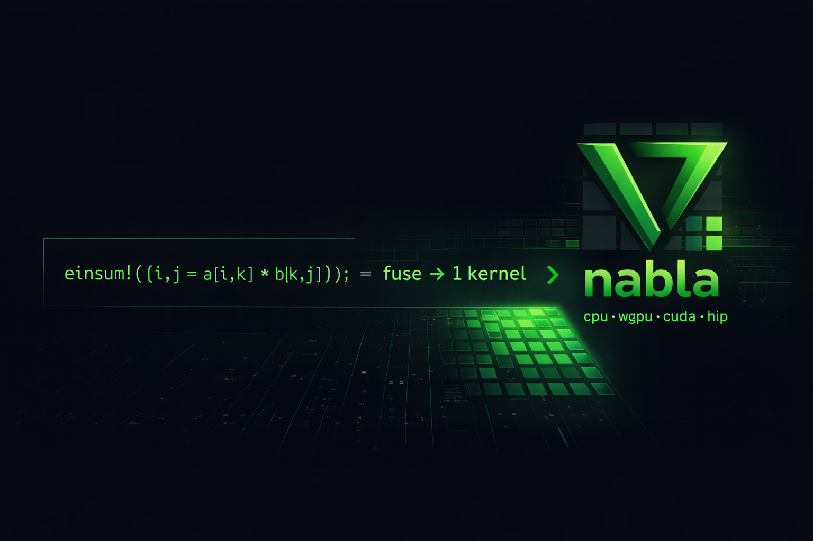

<p align="center">
  
</p>

<p align="center">
  <a href="https://github.com/fumishiki/nabla/actions/workflows/ci.yml"></a>
  <a href="LICENSE"></a>
  <a href="https://www.rust-lang.org"></a>
</p>

# ∇ nabla

**PyTorch-familiar GPU math for Rust — one crate, zero C++ dependencies.**

GPU linear algebra in Rust today means: hand-rolling CUDA kernel strings, wiring cuBLAS through bindgen FFI, deriving gradients by hand. nabla gives you `loss.backward()`, `einsum!`, `fuse!`, and 190+ tensor ops across 4 backends — all pure Rust.

```rust
// This is real nabla code. It runs on CPU, Vulkan, CUDA, or AMD — switch one feature flag.
let a = mat![[1.0, 2.0], [3.0, 4.0]];
let b = mat![[5.0, 6.0], [7.0, 8.0]];
let c = &a * &b;                            // matmul (cuBLAS on GPU)
let y = fuse!(x.sin().powf(2.0); x);        // sin²(x) — 1 GPU kernel, not 2
let loss = train_step!(model, opt, tape, |x, out| out.cross_entropy_indices(&t)?)?;
```

## The pain nabla solves

| | Raw Rust | nabla |
|---|---|---|
| **matmul** | `for i in 0..m { for k in 0..p { for j in 0..n {`<br>`  c[i][j] += a[i][k] * b[k][j]; }}}` | `&a * &b` |
| **GPU fusion** | `"__global__ void k(float* o, float* x, int n) {`<br>`  int i = ...; if(i<n) o[i] = powf(sinf(x[i]),2.0f); }";`<br>`nvrtc::compile(src)?; // + launch config` | `fuse!(x.sin().powf(2.0); x)` |
| **autodiff** | derive ∂L/∂w by hand, or tch-rs: 500 MB C++ FFI + libtorch | `loss.backward(); w.grad()` |
| **einsum** | triple nested loop + index bookkeeping | `einsum!(c[i,j] = a[i,k] * b[k,j])` |
| **solve Ax=b** | LU pivot + forward/back substitution by hand | `a.solve(&b)?` |
| **SVD** | Golub-Reinsch bidiag → QR iteration (hundreds of lines) | `a.svd()?` |
| **symbolic diff** | symengine C++ FFI, or hand-built Expr tree | `diff(&sym!(x^2 * sin(x)), "x")` |
| **ODE** | hand-written RK4 loop + adaptive step + collect | `rk4(f, y0, 0.0, 5.0, 0.01)` |

## Benchmark (GH200 480GB)

**Reproduce in one command** — requires CUDA GPU + PyTorch:
```bash
cd benchmarks && bash run.sh
```

### Op throughput — 4096×4096 f32

| Operation | nabla | PyTorch | |
|---|---|---|---|
| **matmul 4096²** | **0.358 ms** | 2.675 ms | **nabla 7.5×** ¹ |
| **fuse exp+sin** | **0.041 ms** | 0.081 ms | **nabla 2.0×** |
| sin / cos / tanh | 0.040 ms | 0.041 ms | parity |
| sum\_all / max\_all | 0.028 ms | 0.026 ms | parity |

¹ cuBLAS TF32 (nabla default) vs PyTorch default precision. Apples-to-apples TF32 comparison: ~1.6×.

### MLP training end-to-end — 784→256→128→10, SGD, f32

| Batch | nabla eager | nabla graph | PT eager | PT graph |
|------:|------------:|------------:|---------:|---------:|
| 1     | 0.111 ms    | 0.070 ms    | 0.710 ms | 0.045 ms |
| 128   | 0.133 ms    | **0.088 ms** | 0.976 ms | 0.130 ms |
| 1024  | 0.170 ms    | **0.130 ms** | 0.966 ms | 0.160 ms |

nabla eager 4-6× faster than PyTorch eager. CUDA Graph: nabla wins batch≥128.

## Install

```toml
[dependencies]
nabla = { git = "https://github.com/fumishiki/nabla", features = ["cpu"] }       # CPU (default)
# nabla = { ..., default-features = false, features = ["cuda"] }                 # NVIDIA GPU
# nabla = { ..., default-features = false, features = ["wgpu"] }                 # Vulkan/Metal/DX12
# nabla = { ..., default-features = false, features = ["hip"] }                  # AMD GPU
```

Backends are **mutually exclusive** at build time. No implicit CPU fallback. No CUDA SDK needed — runtime `libloading`.

## Quick start

```rust
use nabla::prelude::*;

let a = mat![[1.0, 2.0], [3.0, 4.0]];
let x = a.solve(&mat![[5.0], [6.0]])?;               // Ax = b
let (u, s, vt) = a.svd()?;                            // SVD
let c: Tensor<f64> = einsum!(c[i,j] = a[i,k] * b[k,j]);  // Einstein summation
let y = fuse!(x.sin().powf(2.0); x);                  // GPU kernel fusion

// Reverse-mode autodiff — PyTorch-familiar
let tape = Tape::new();
let w = tape.var(&weights);
let loss = (&w * &x).sum();
loss.backward();
let dw = w.grad();   // tape + grads freed on scope exit (no GC, no zero_grad())

// Training
let model = Sequential::new()
    .add(Linear::new(784, 128)).add(Activation::relu())
    .add(Linear::new(128, 10));
let loss = train_step!(model, optimizer, tape, |x, out| {
    out.cross_entropy_indices(&targets)?
})?;
```

## What's inside

- **190+ tensor ops** — matmul, conv, softmax, attention, loss, pooling, normalization, activation, …
- **Autodiff** — reverse-mode tape, forward-mode `Dual<T>`, `GpuTape` GPU-resident AD, `#[nabla_grad]`
- **29 macros** — `mat!` `einsum!` `fuse!` `mega_fuse!` `stencil!` `sym!` `ad!` `train_step!` `#[derive(Module)]`
- **Linear algebra** — 9 factorizations (LU/QR/Cholesky/SVD/Eigen/…), sparse CSC + GPU BCSR SpMM
- **Symbolic CAS** — `diff` / `simplify` (E-graph 57 rules) / `eval` / `eval_tensor`
- **ODE solvers** — Euler, RK4, Dormand-Prince, BDF-1, IF-Euler, parareal
- **Training** — SGD/Adam/AdamW, LR schedules, `GradScaler` AMP, `Trainer`, `DataLoader`
- **4 backends** — cpu (Rust+rayon) · wgpu (WGSL) · cuda (NVRTC JIT, CUDA Graph) · hip (hiprtc)
- **GGUF export** — 34 quantization types, llama.cpp FFI inference

293 tests · MSRV 1.88 · Pure Rust — no LAPACK, no BLAS, no C++ · [Spec](docs-en/spec.md) · [Notation](docs-en/notation.md) · [Quick start](docs-en/quick_start.md)

## Examples

```bash
cargo run --example 01_matrix_ops --features cpu        # matrix ops + LU solve
cargo run --example 04_autograd_mlp --features cpu      # reverse-mode AD
cargo run --example 05_ode_lorenz --features cpu        # Lorenz attractor
cargo run --example 07_einsum_attention --features cpu  # einsum! attention
cargo run --example 08_cas_symbolic --features cpu      # symbolic diff
# ... 10 examples total (see nabla-ml/examples/)
```

## Building & testing

```bash
cargo test --features cpu                              # all tests
cargo clippy --workspace --all-targets -- -D warnings  # lint
```

## Contributing

Fork → feature branch → `cargo test && cargo clippy && cargo fmt --check` → PR against `main`.

---

**fumishiki** — [GitHub](https://github.com/fumishiki) · [X](https://x.com/fumishiki) · [LinkedIn](https://linkedin.com/in/fumitakamurakami) · [Hugging Face](https://huggingface.co/fumishiki)

[Apache-2.0](LICENSE-APACHE) OR [MIT](LICENSE-MIT), at your option.
